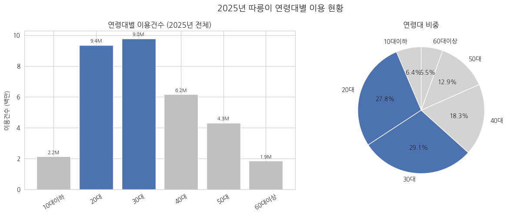
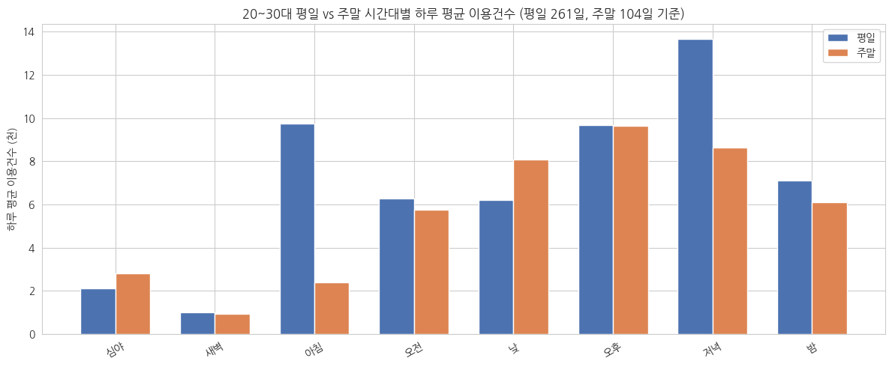
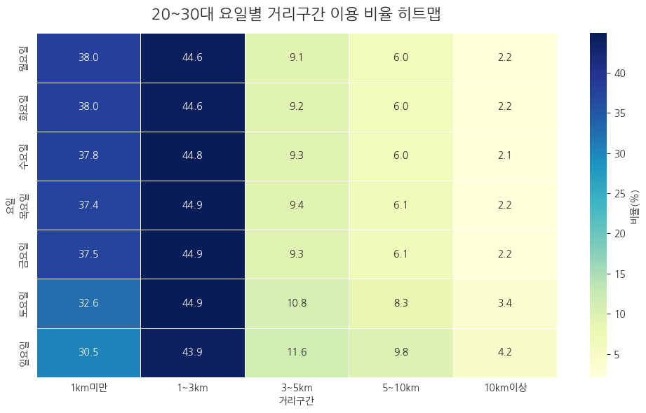

# 서울시 따릉이 이용 패턴 분석

**2025년 대여이력 데이터를 활용한 2030세대의 시간·요일·이동거리별 이용 행태 분석**

초급 데이터 분석 프로젝트 · 6인 팀 프로젝트 · 따릉이 타려다 따흐흑

약 3,737만 건의 대여이력을 정제하고, 연령대별 이용 규모와 시간·요일·거리 패턴을 비교하여 정비 및 재배치 방향을 제안했습니다. 본 저장소는 팀의 최종 보고서, 발표자료, 통합 Colab 노트북을 채용 포트폴리오 형태로 정리한 것입니다.

| 핵심 지표 | 결과 |
| --- | --- |
| 원본 대여이력 | 37,372,654건 |
| 정제 후 분석 대상 | 33,664,470건 |
| 제거한 대여이력 | 3,708,184건 · 원본 대비 9.92% |
| 2030세대의 대여 건수 비중 | 56.9% · 20대 27.8%, 30대 29.1% |
| 주요 시간 패턴 | 평일 아침·저녁 집중, 주말 낮·오후 중심 |

위 수치는 제출 자료와 노트북에 저장된 실행 결과를 기준으로 합니다. 원본 데이터를 다시 실행하여 산출한 결과는 아닙니다. 비중의 관측 단위는 **대여 건**이며, 고유 이용자 수를 뜻하지 않습니다.

[분석 노트북](notebooks/seoul_bike_analysis.ipynb) · [최종 보고서](docs/final_report.docx) · [발표자료](docs/presentation.pdf) · [데이터 안내](data/README.md)

## 1. 프로젝트 개요

| 항목 | 내용 |
| --- | --- |
| 프로젝트 기간 | 2026.05.29 ~ 2026.06.12 |
| 분석 기간 | 2025.01.01 ~ 2025.12.31 |
| 목적 | 핵심 이용층의 이용 패턴을 파악하고 운영 효율화 방향 제안 |
| 분석 유형 | 탐색적 데이터 분석(EDA), 기술통계, 다차원 교차 집계 |
| 사용 도구 | Python, pandas, NumPy, Matplotlib, seaborn, Google Colab |
| 이창준의 담당 역할 | 탐색 / 문제정의 · 보고서 표지 기준 |

## 2. 문제 정의

팀은 따릉이의 운영비 부담, 이용 증가세 둔화, 기기 상태 및 대여·반납 과정에 대한 불만을 분석 배경으로 설정했습니다. 한정된 운영 자원을 언제 투입할지 판단하기 위해 다음 질문을 중심으로 분석했습니다.

> 2030세대는 언제, 얼마나, 어떻게 다르게 움직이는가?

- 연령대별 대여 건수에서 20·30대가 차지하는 비중은 얼마나 큰가?
- 월별 이용량과 계절 변화는 연령대에 따라 어떻게 나타나는가?
- 평일과 주말의 주요 이용 시간대는 어떻게 다른가?
- 이동거리 분포와 시간대의 차이는 운영 전략에 어떤 시사점을 주는가?

개인 경험에서 출발한 가설을 집계 결과와 대조하는 탐색적 접근을 사용했습니다. 통계적 유의성 검정이나 인과효과 추정은 수행한 것으로 제시하지 않습니다.

## 3. 데이터

| 자료 | 관측 단위 및 범위 | 활용 |
| --- | --- | --- |
| 서울열린데이터광장 따릉이 대여이력 | 개별 대여 건 · 2025년 12개월 | 시간·요일·거리·연령대 분석의 주 자료 |
| 서울 기온 자료 | 서울 ASOS 108 지점 · 2025년 일평균 기온의 월별 평균 | 월별 수요 변화 해석 보조 · 보고서 기준 |
| App Store·Google Play 앱 리뷰 | 개별 리뷰 · 보고서 데이터 소개 표에는 2025.06.01 ~ 2026.06.01로 기재 | 서비스 불편 요인에 대한 정성적 참고 |

주요 변수는 대여일시, 반납일시, 이용시간(분), 이용거리(M), 생년입니다. 노트북은 자전거번호, 성별, 이용자종류, 자전거구분도 읽습니다. 자전거번호는 자전거 식별자이며 개인 이용자 식별자로 해석하지 않습니다.

원본 CSV, 월별 집계 CSV, 기온 및 리뷰 원자료는 이 저장소에 포함하지 않았습니다. 출처와 준비 방법은 [data/README.md](data/README.md)에 정리했습니다.

## 4. 데이터 전처리

노트북은 월별 파일을 순차적으로 읽고 정제·집계한 뒤 연간 집계 데이터를 결합합니다. 핵심 변수의 `\\N` 표기를 결측값으로 읽고, 논리 오류와 속도 이상치를 제거합니다.

| 단계 | 기준 | 처리 후 건수 | 제거 건수 |
| --- | --- | ---: | ---: |
| 원본 | 12개월 합계 | 37,372,654 | — |
| 중복 제거 | 월별로 읽은 컬럼의 값이 모두 같은 행 | 37,372,653 | 1 |
| 핵심 변수 결측 제거 | 생년·시간·거리·대여 및 반납일시 | 34,953,656 | 2,418,997 |
| 날짜 오류 제거 | 날짜 파싱 실패 또는 반납일시 < 대여일시 | 34,953,656 | 0 |
| 이용시간 필터 | 0분 초과, 1,440분 이하 | 34,929,252 | 24,404 |
| 이용거리 필터 | 0m 초과 | 34,466,698 | 462,554 |
| 생년 필터 | 1945 ~ 2011 | 34,264,279 | 202,419 |
| 속도 이상치 필터 | 월별 Q1 − 1.5×IQR ~ Q3 + 1.5×IQR | 33,664,470 | 599,809 |

성별은 대소문자를 통일하고 결측값은 유지합니다. 전체 제거 비율은 `3,708,184 / 37,372,654 ≈ 9.92%`입니다. 전처리 건수는 보고서 표 II-3, 발표자료 7쪽, 노트북의 연간 처리 로그가 일치합니다.

## 5. 파생변수

| 변수 | 생성 방식 |
| --- | --- |
| 나이·연령대 | `2025 − 생년`, 10대 이하 / 20대 / 30대 / 40대 / 50대 / 60대 이상 |
| 대여월 | 대여일시에서 월 추출 |
| 대여요일·주말여부 | 월요일=0 ~ 일요일=6, 토·일을 주말로 구분 |
| 시간대 | 3시간 단위: 심야 0~3, 새벽 3~6, 아침 6~9, 오전 9~12, 낮 12~15, 오후 15~18, 저녁 18~21, 밤 21~24시 |
| 이용거리_km | 미터를 km로 변환하고 소수점 셋째 자리까지 반올림 |
| 거리구간 | 1km미만 / 1~3km / 3~5km / 5~10km / 10km이상이라는 원본 코드의 구간명 |
| 속도_kmh | 이용거리(km) ÷ (이용시간(분) / 60), 소수점 둘째 자리까지 반올림 |

나이는 생일을 고려한 만 나이가 아닌 연도 차이입니다. 시간대는 하한을 포함하고 상한을 제외합니다. 거리구간은 원본 코드의 `pd.cut` 기본 설정에 따라 **상한을 포함**합니다. 따라서 1·3·5·10km 경계값은 보고서의 ‘미만/이상’ 표현과 차이가 있으며, 아래 결과의 거리구간명은 원본 자료의 명칭을 따릅니다.

## 6. 분석 방법

분석 흐름은 **월별 원본 탐색 → 전처리 → 파생변수 생성 → 월별 집계 저장 → 연간 통합 → 교차 분석 → 운영 제안**입니다.

- 집계 기준: 대여월 × 연령대 × 시간대 × 대여요일 × 주말여부 × 거리구간
- 집계 지표: 이용건수, 평균·중앙값 이용시간, 평균·중앙값 이용거리, 평균 속도
- 평일·주말 비교: 2025년 평일 261일, 주말 104일로 나누어 하루 평균 비교
- 요일 비교: 실제 달력상 해당 요일의 일수로 보정
- 평균 속도 재집계: 그룹별 평균 속도에 이용건수를 가중치로 적용
- 시각화: 막대·선 그래프, 비중 차트, 히트맵

‘표준화’는 성별 표기 통일과 관측 일수 보정을 뜻합니다. 모델 학습을 위한 스케일링이나 머신러닝 군집화는 수행하지 않았습니다.

## 7. 핵심 결과

### 7.1 2030세대가 전체 대여 건수의 56.9%를 차지

20대는 27.8%, 30대는 29.1%로 두 연령대가 분석 대상 대여 건수의 과반을 차지했습니다. 이는 핵심 수요층을 중심으로 시간·요일별 패턴을 살펴볼 근거가 됩니다.



### 7.2 평일 아침·저녁과 주말 낮·오후의 수요 차이

2030세대의 평일 하루 평균은 아침(6~9시) 9,750건, 저녁(18~21시) 13,657건입니다. 같은 시간대의 주말 평균은 각각 2,404건, 8,648건입니다. 주말은 낮·오후 중심으로 이용이 증가하며, 30대는 평일 아침·저녁 피크가 뚜렷하고 20대는 상대적으로 분산된 패턴을 보였습니다.



출퇴근·통학·여가라는 이용 목적은 시간대와 요일로부터 추정한 해석입니다. 실제 목적을 직접 관측한 결과는 아닙니다.

### 7.3 전 연령대에서 단거리 중심의 이동 구조

원본 자료에서 ‘1km미만’과 ‘1~3km’로 표시한 구간이 대부분을 차지했습니다. 2030세대 역시 평일·주말 모두 단거리 중심이며, 보고서는 주말의 3km 이상 중·장거리 비중이 평일보다 약 6.1%p 높다고 제시합니다. ‘중·장거리 이용이 많을 것’이라는 초기 가설과 다른 결과를 확인했습니다.



### 7.4 계절에 따라 수요가 변동

최종 보고서는 6월·9월 이용 증가와 2월·7월 감소를 설명합니다. 2030세대는 4050세대보다 월별 이용 건수의 절대 변화폭이 크게 나타났습니다. 집단 규모 차이가 있으므로 이 결과만으로 연령별 기온 민감도의 차이를 확정하지 않습니다. 기온·강수·휴일 등을 함께 통제하는 후속 분석이 필요합니다.

차트는 첨부 노트북에 저장된 실행 출력에서 추출했습니다. 새로 계산하거나 수정한 그림이 아닙니다. 수치와 해석의 근거는 보고서 II.3 및 노트북의 해당 집계·시각화 셀입니다.

## 8. 운영 개선 제안

| 관찰한 패턴 | 팀의 제안 | 기대 효과와 확인할 사항 |
| --- | --- | --- |
| 겨울 수요 감소, 기기 상태 불만 | 겨울 비수기에 집중 점검·예방정비 | 성수기 공백 완화 가능성 · 고장률·정비 소요시간 측정 필요 |
| 평일 아침·저녁 수요 집중 | 해당 시간대의 공급·재배치 강화 | 자전거 부족 완화 가능성 · 대여소별 재고 및 수요 분석 필요 |
| 주말 낮·오후 수요 증가 | 주말 시간대에 맞춘 재배치 우선순위 설정 | 반납 불편 완화 가능성 · 공간 정보와 현장 검증 필요 |

운영 제안은 분석 결과를 바탕으로 한 개선 방향입니다. 비용 절감이나 만족도 향상을 실제로 검증한 성과로 제시하지 않습니다.

## 9. 본인 기여

**이창준 — 탐색 / 문제정의**

최종 보고서 표지에서 이창준의 역할은 ‘탐색 / 문제정의’로 명시되어 있습니다. 본 포트폴리오에서는 이 역할에 참여한 것으로만 기술합니다. 문제 정의와 분석 질문은 팀 산출물로 제시하며, 세부 문장의 단독 작성 여부는 자료만으로 확인되지 않습니다.

데이터 준비, 전처리 코드 작성, 전체 분석, 시각화 또는 노트북 전체 개발을 이창준 개인의 성과로 귀속하지 않습니다. 첨부 코드와 결과는 팀의 공동 산출물입니다.

## 10. 한계 및 개선 방향

- **관측 범위:** 2025년 한 해만 분석했습니다. 여러 해의 데이터로 반복되는 계절 패턴인지 확인할 필요가 있습니다.
- **이용 목적:** 출퇴근·여가는 간접 추정입니다. 설문이나 목적지 정보를 연계해야 검증할 수 있습니다.
- **공간·외부 변수:** 대여소 위치·재고, 상권·인구 구성, 강수·미세먼지 등을 함께 분석하지 않았습니다. 특정 대여소의 최적 재배치량을 제시할 수 없습니다.
- **정제 편향:** 생년 결측 및 범위 필터, 월별 속도 IQR 필터가 특정 이용 유형을 제외할 수 있습니다. 전처리 전후 분포와 기준별 민감도 비교가 필요합니다.
- **리뷰:** 자발적 작성 표본이며 작성자 연령을 알 수 없습니다. 대여이력과 기간도 완전히 일치하지 않아 2030세대 전체의 의견으로 일반화하지 않습니다.
- **자료 표기 차이:** 발표자료 28쪽의 대여이력 기간은 2026년까지로 기재되어 있지만 보고서 데이터 표와 코드의 처리 월은 2025년입니다. README는 코드와 데이터 소개 표를 기준으로 합니다. 리뷰 기간은 보고서 표와 본문 간 차이가 있어 수집 로그 확인이 필요합니다.
- **코드·설명 차이:** 거리 경계값은 코드가 상한 포함으로 처리합니다. 노트북 초기 월별 해석 일부도 최종 보고서와 다르므로 결과 재현 후 설명을 통일하는 것이 후속 과제입니다.
- **재현 범위:** 노트북은 팀의 기존 Drive 경로와 별도 집계 파일을 참조합니다. 원본 데이터 없이 전체 실행을 검증하지 않았고, 외부 기온·리뷰 분석이 모두 포함된 완결형 파이프라인으로 제시하지 않습니다.

세부 차이와 재현 조건은 [검토 메모](docs/source_review.md) 및 [실행 안내](notebooks/README.md)를 참고해 주세요.

## 11. 저장소 구조

```text
seoul-bike-usage-analysis/
├── README.md
├── .gitignore
├── requirements.txt
├── notebooks/
│   ├── README.md
│   └── seoul_bike_analysis.ipynb
├── docs/
│   ├── final_report.docx
│   ├── presentation.pdf
│   └── source_review.md
├── images/
│   ├── age_distribution.png
│   ├── weekday_weekend.png
│   └── distance_pattern.png
└── data/
    └── README.md
```

보고서·발표자료·노트북은 파일명만 정리하고 원본 내용을 보존했습니다. 노트북의 출력은 기존 집계·시각화 결과입니다. 원본 행 데이터 및 대용량 데이터 파일은 업로드하지 않았습니다.
